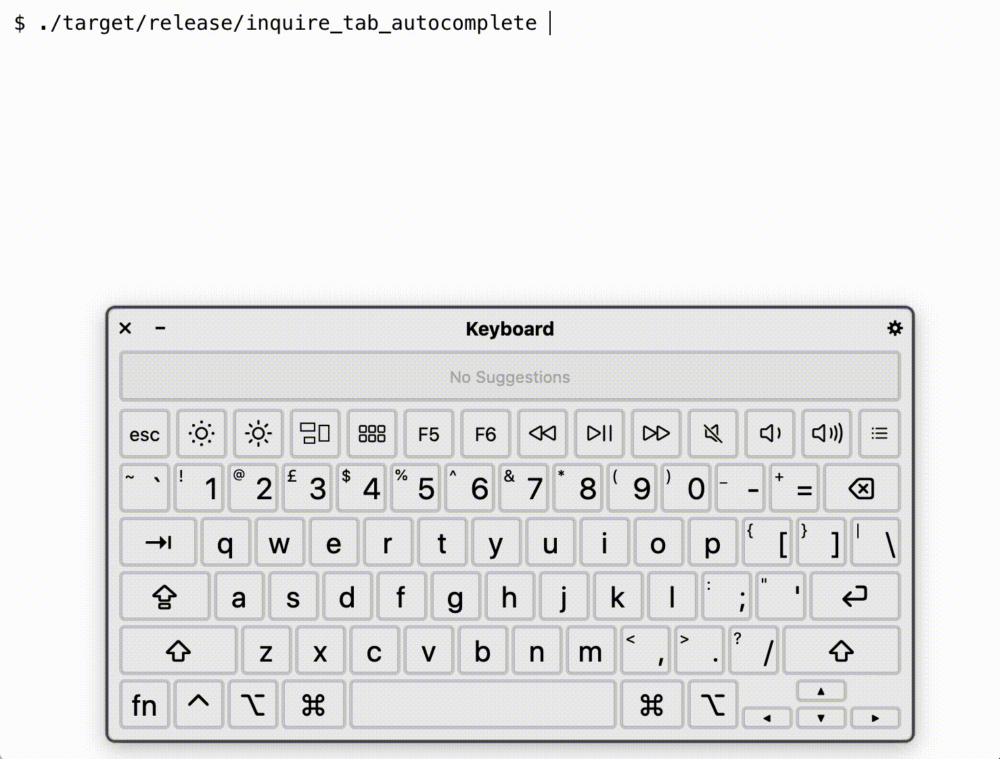

# inquire_tag_autocomplete

This is an experiment with the autocomplete functionality in the Rust crate [inquire](https://crates.io/crates/inquire).

In particular, suppose I want the user to pick some tags.
I already have some tags they might want to use, or they can add new ones.

I want a `Text` input where I can:

* enter multiple tags, separated by spaces
* get suggestions and autocomplete for already-known tags
* create brand new tags

This is what it looks like:

Here's what I'm doing:

1.  Initially I'm shown all five known tags (`adventure`, `action`, `mystery`, `romance` and `scifi`).

2.  I type `adv` and then press `tab`.
    This autocompletes to the known tag `adventure`.

3.  I type `s`, which shows me the two tags that contain `s` (`mystery` and `scifi`).
    I use the arrow keys to select `scifi`.

4.  I type `a` and then press `tab`.
    This autocompletes to the known tag `action`.

    Notice that `adventure` isn't offered as a suggestion: it knows I already have this tag.

5.  I start typing `ro`.
    It suggests the known tag `romance`, but I keep typing the new tag `robots`.

6.  I press `enter` to complete my typing, and I see the list of tags I've given (`adventure`, `scifi`, `action` and `robots`).

I already know one project where I want to use it, but I can imagine this is the sort of component I might want to use in a bunch of places.
I've pulled it into a standalone repo so it's easier to find and maintain as a reusable snippet.

## Usage

Copy the code from `main.rs` into your project.
Play around with it.
Tweak it.
Fiddle with the details.

The behaviour probably isn't quite right for what you need, but hopefully it's a starting point.
